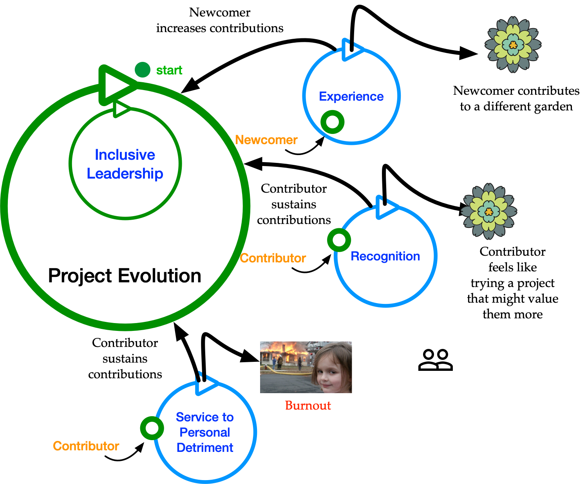

# Centering Diversity, Equity, and Inclusion in -- name of your project --

This document demonstrates how we in -- name of your project -- are committed to centering diversity, equity, and inclusion in the work that we do. The following are four CHAOSS DEI metrics and how we address them in the -- name of your project --. 

## Why Four Key Metrics, and Why These Four?

The Linux Foundation's CHAOSS Project started developing open source software health and sustainability metrics starting in 2017, currently has around 80 published metrics, a number of metrics aggregations called "metrics models", badging programs like this one, and two core OSS Health metrics tools. Over the course of these years, we discussed trade offs between succinct utility, and exhautiveness. These four metrics: 
1. Help open-source projects to consider themselves from a new perspective
2. Illustrate how many of the challenges open source software projects face when developing a more diverse contributor community are similar, and related to opportunities and obstacles for growing the number of project contributors "period". 
3. Cover an approximate, if incomplete breadth of DEI considerations. 

How these four metrics may be conceptually related is illustrated in figure one.

## An Abridged Set of Metrics for Developing a Perspective on Your Project's Diversity, Equity, and Inclusion

### [Newcomer Experience](https://docs.google.com/document/d/1EbLKdac1IysMO9f3pQZBAUVNWLZ5S6BRUU3KYYx9r30/edit?usp=sharing)
Provide evidence as to how your community addresses the newcomer experience.

### [Project Burnout](https://chaoss.community/metric-project-burnout/)
Provide evidence as to how your community addresses project burnout.

### [Recognizing Contributors](https://chaoss.community/metric-contributors/)
Provide evidence as to how your community recognizes a wide varity of contributors.

### [Inclusive Leadership](https://chaoss.community/metric-inclusive-leadership/)
Provide evidence as to how your community addresses inclusive leadership.
